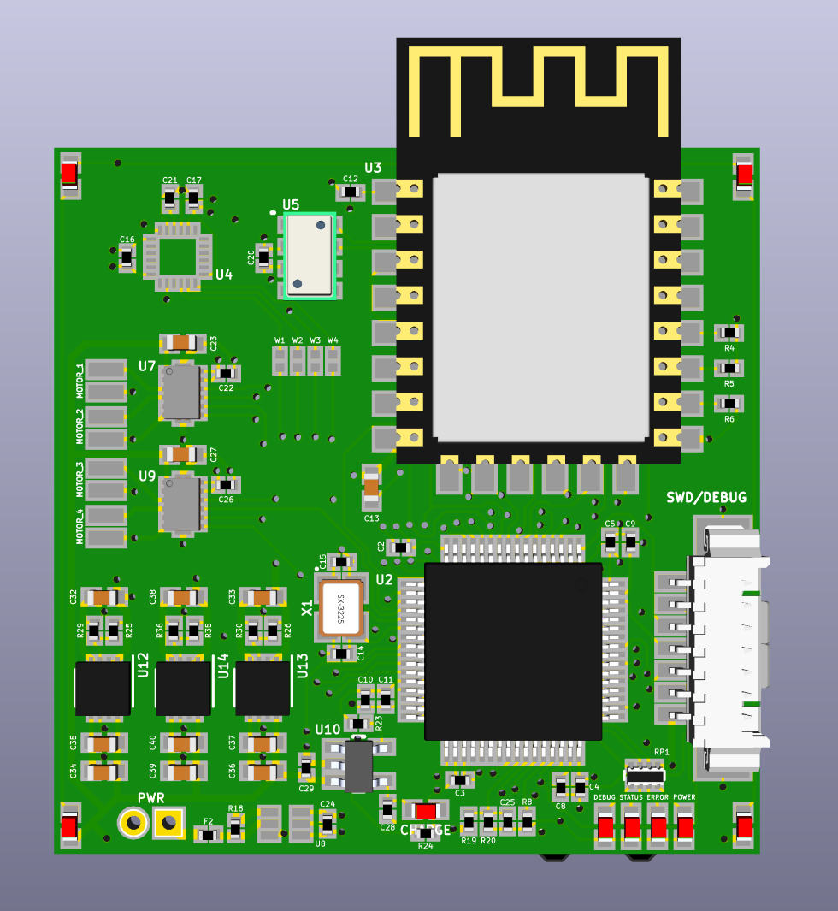
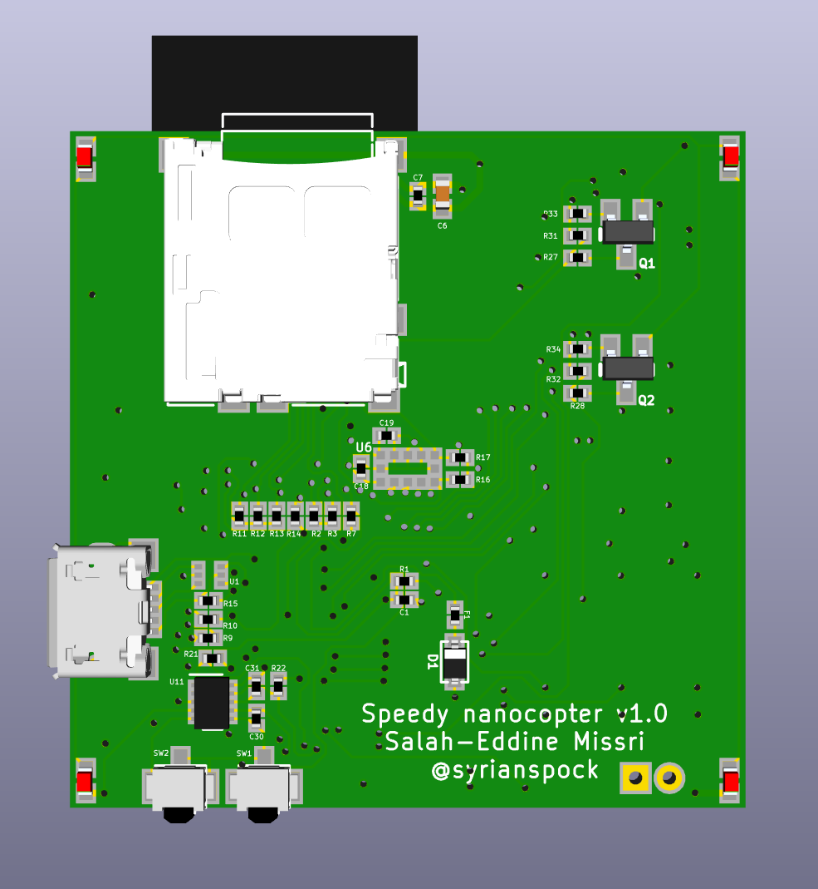

Speedy, the nanocopter
======================

The aim of this project is to design a board enabling the control of a small quadrotor (nanocopter) that can be tracked by external visual sensors.

### Specifications
* Cortex M4 MCU
* Four infrared LEDs on each side of the board for IR vision tracking. Each side can be controlled separately.
* Two full H bridges: one half bridge per motor to allow active braking of the motors.
* IMU:
    - MPU9250 (9 axis): accelerometer, gyroscope and magnetometer
    - MS5611 barometer
* Ground distance sensor:
    - ST VL53L0X for landing / ground approach
* Telemetry module:
    - ESP12E for telemetry and telecommand through WiFi
* USB interface (for DFU programming / serial interface) and power/charging
* Battery management unit
	- Monitor battery (current, voltage)
	- Supply power to the board from a LiPo (1S) input
	- Recharge the battery through USB

### PCB

The 40mm x 40mm board is rendered below

